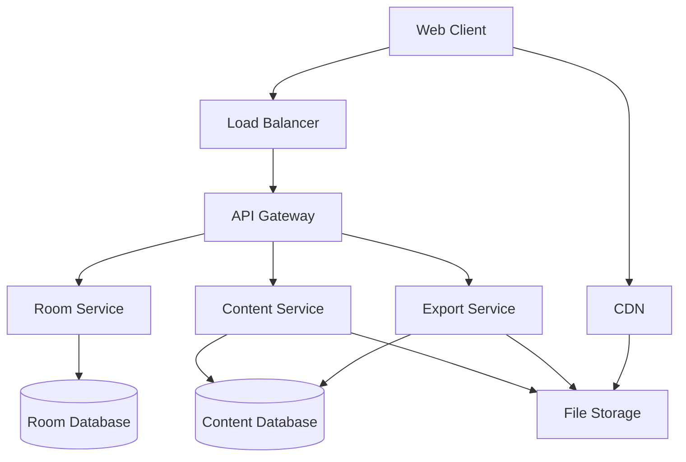

# Design Document: Instant-Rooms Platform

## Overview

Instant-rooms is a lightweight, room-based content sharing platform designed for frictionless collaboration. The system enables users to create shared spaces accessible via unique codes, supporting multi-format content (text, images, PDFs) without requiring user accounts. The architecture prioritizes simplicity, performance, and security while maintaining a clean separation between frontend presentation, backend services, and storage layers.

The platform follows a stateless, microservices-inspired architecture with clear boundaries between room management, content handling, and storage operations. This design ensures scalability while keeping the system simple enough to understand and maintain.

## Architecture

### High-Level Architecture



### Service Architecture Principles

1. **Stateless Services**: All services are stateless to enable horizontal scaling
2. **Clear Boundaries**: Each service has a single responsibility with well-defined interfaces
3. **Storage Abstraction**: Database and file storage are abstracted behind service interfaces
4. **Performance First**: CDN integration and lazy loading for optimal user experience
5. **Security by Design**: Unguessable identifiers and input validation at every layer

### Technology Stack Considerations

Based on research into scalable content sharing platforms, the architecture supports:
- **Frontend**: Single-page application with drag-and-drop capabilities using modern JavaScript/TypeScript
- **Backend**: RESTful API services with JSON communication
- **Storage**: Relational database for metadata, object storage for files
- **CDN**: Content delivery network for file serving and caching
- **PDF Rendering**: PDF.js or similar library for in-browser PDF preview

## Components and Interfaces

### Room Service

**Responsibilities:**
- Room creation and unique code generation
- Access control and permission management
- Room expiry and cleanup operations
- Timeline state management

**Key Interfaces:**
```typescript
interface RoomService {
  createRoom(options: RoomCreationOptions): Promise<Room>
  getRoom(roomCode: string): Promise<Room | null>
  updateAccessMode(roomCode: string, mode: AccessMode): Promise<void>
  setExpiry(roomCode: string, expiry: Date): Promise<void>
  pinRoom(roomCode: string): Promise<void>
  cleanupExpiredRooms(): Promise<void>
}

interface Room {
  code: string
  accessMode: AccessMode
  createdAt: Date
  expiresAt: Date | null
  isPinned: boolean
  contentItems: ContentItem[]
}

enum AccessMode {
  FULL_ACCESS = "full",
  READ_ONLY = "read_only", 
  DROP_ONLY = "drop_only"
}
```

**Room Code Generation:**
- Uses cryptographically secure random generation
- 8-character alphanumeric codes (excluding ambiguous characters)
- Collision detection with retry mechanism
- Entropy: ~41 bits (36^8 combinations with filtered character set)

### Content Service

**Responsibilities:**
- Content upload and validation
- File type detection and processing
- Content retrieval and serving
- Version history management

**Key Interfaces:**
```typescript
interface ContentService {
  uploadContent(roomCode: string, content: ContentUpload): Promise<ContentItem>
  getContent(contentId: string): Promise<ContentItem | null>
  deleteContent(contentId: string): Promise<void>
  getContentHistory(roomCode: string): Promise<ContentItem[]>
  restoreVersion(roomCode: string, timestamp: Date): Promise<void>
}

interface ContentItem {
  id: string
  roomCode: string
  type: ContentType
  data: ContentData
  metadata: ContentMetadata
  createdAt: Date
  version: number
}

enum ContentType {
  TEXT = "text",
  CODE = "code", 
  IMAGE = "image",
  PDF = "pdf",
  FILE_BLOB = "file_blob"
}
```

**Content Detection Logic:**
Based on research into drag-and-drop implementations, the system uses:
1. MIME type detection for uploaded files
2. Content analysis for pasted text (code syntax detection)
3. File extension validation as fallback
4. Graceful degradation to file blob for unsupported types

### Export Service

**Responsibilities:**
- Room content aggregation
- Multi-format export generation
- ZIP packaging and Markdown conversion
- PDF generation with annotations

**Key Interfaces:**
```typescript
interface ExportService {
  exportAsZip(roomCode: string): Promise<Buffer>
  exportAsMarkdown(roomCode: string): Promise<string>
  exportAsPdf(roomCode: string): Promise<Buffer>
}

interface ExportOptions {
  includeMetadata: boolean
  includeHistory: boolean
  format: ExportFormat
}
```

### File Storage Abstraction

**Responsibilities:**
- File upload and retrieval
- CDN integration
- Automatic cleanup for expired content
- Malware scanning integration

**Key Interfaces:**
```typescript
interface FileStorage {
  uploadFile(file: File, metadata: FileMetadata): Promise<string>
  getFileUrl(fileId: string): Promise<string>
  deleteFile(fileId: string): Promise<void>
  scanFile(fileId: string): Promise<ScanResult>
}
```

## Data Models

### Room Data Model

```typescript
interface RoomEntity {
  code: string              // Primary key, 8-char alphanumeric
  access_mode: string       // "full", "read_only", "drop_only"
  created_at: Date
  expires_at: Date | null   // null for pinned rooms
  is_pinned: boolean
  content_count: number     // Denormalized for performance
  last_activity: Date
}
```

### Content Data Model

```typescript
interface ContentEntity {
  id: string                // UUID primary key
  room_code: string         // Foreign key to rooms
  type: string              // "text", "code", "image", "pdf", "file_blob"
  title: string | null      // Optional user-provided title
  data: ContentData         // Polymorphic based on type
  file_id: string | null    // Reference to file storage
  metadata: object          // JSON metadata (size, mime_type, etc.)
  created_at: Date
  version: number           // For history tracking
  is_deleted: boolean       // Soft delete for history
}

// Polymorphic content data
type ContentData = 
  | { type: "text"; content: string }
  | { type: "code"; content: string; language?: string }
  | { type: "image"; fileId: string; alt?: string }
  | { type: "pdf"; fileId: string; pageCount: number }
  | { type: "file_blob"; fileId: string; filename: string }
```

### Version History Model

```typescript
interface VersionSnapshot {
  room_code: string
  snapshot_at: Date
  content_state: ContentEntity[]  // Full state at this point
  trigger_event: string           // "content_added", "content_deleted", etc.
}
```

## Error Handling

### Error Classification

1. **Client Errors (4xx)**
   - Invalid room codes
   - Unsupported file types
   - File size exceeded
   - Rate limit exceeded

2. **Server Errors (5xx)**
   - Storage failures
   - Service unavailable
   - Processing timeouts

3. **Security Errors**
   - Malware detected
   - Suspicious upload patterns
   - Access denied

### Error Response Format

```typescript
interface ErrorResponse {
  error: {
    code: string
    message: string
    details?: object
    retryable: boolean
  }
  timestamp: string
  requestId: string
}
```

### Graceful Degradation

- **File Upload Failures**: Show clear error messages with retry options
- **PDF Rendering Issues**: Fallback to download link
- **Network Issues**: Offline indicator with retry mechanisms
- **Storage Limits**: Clear warnings before limits are reached

## Testing Strategy

### Dual Testing Approach

The testing strategy employs both unit tests and property-based tests to ensure comprehensive coverage:

**Unit Tests:**
- Focus on specific examples, edge cases, and error conditions
- Test integration points between services
- Validate error handling and boundary conditions
- Cover specific user scenarios and workflows

**Property-Based Tests:**
- Verify universal properties across all inputs using randomized testing
- Test system invariants and correctness properties
- Ensure robustness across wide input ranges
- Validate round-trip operations and data integrity

**Testing Configuration:**
- Property-based tests will use a suitable library (QuickCheck for Haskell, Hypothesis for Python, fast-check for JavaScript/TypeScript)
- Each property test runs minimum 100 iterations to ensure statistical confidence
- Tests are tagged with references to design properties: **Feature: instant-rooms, Property {number}: {property_text}**

**Integration Testing:**
- End-to-end workflows through API endpoints
- File upload and processing pipelines
- Room expiry and cleanup processes
- Export generation and download flows

**Performance Testing:**
- Load testing for concurrent room access
- File upload performance under various sizes
- PDF rendering performance benchmarks
- Database query optimization validation

## Correctness Properties

*A property is a characteristic or behavior that should hold true across all valid executions of a system—essentially, a formal statement about what the system should do. Properties serve as the bridge between human-readable specifications and machine-verifiable correctness guarantees.*

### Property 1: Room Code Uniqueness and Security
*For any* set of room creation requests, all generated room codes should be unique, unguessable (meeting cryptographic entropy requirements), and collision-free across the entire system.
**Validates: Requirements 1.2, 10.4**

### Property 2: Room Access Control Enforcement  
*For any* room and access mode combination, the system should enforce permissions correctly: full access allows all operations, read-only prevents modifications while allowing viewing, and drop-only allows additions while preventing viewing of existing content.
**Validates: Requirements 4.1, 4.2, 4.3, 4.4**

### Property 3: Content Storage Round-Trip Integrity
*For any* valid content item (text, code, image, PDF, or file blob), storing the content and then retrieving it should produce equivalent data with preserved formatting, metadata, and file integrity.
**Validates: Requirements 2.1, 11.1, 11.5, 12.1, 12.3**

### Property 4: Content Type Detection and Processing
*For any* uploaded or pasted content, the system should correctly detect the content type and process it appropriately: text becomes text blocks, code gets syntax highlighting, images get previews, PDFs get page navigation, and unsupported files become downloadable blobs.
**Validates: Requirements 3.1, 3.2, 3.3, 3.4, 3.5**

### Property 5: Timeline Chronological Ordering
*For any* sequence of content additions to a room, the timeline should always display items in chronological order based on creation time, regardless of the order in which they were added or retrieved.
**Validates: Requirements 5.1, 5.2**

### Property 6: Version History Preservation and Restoration
*For any* room with content modifications, the system should preserve all previous states in history, allow viewing of any historical state, and enable restoration to any previous state with complete fidelity.
**Validates: Requirements 6.1, 6.2, 6.3**

### Property 7: Export Completeness and Format Integrity
*For any* room with content, each export format (ZIP, Markdown, PDF) should include all room content in the appropriate format with proper structure, references, and metadata preservation.
**Validates: Requirements 7.1, 7.2, 7.3**

### Property 8: Room Expiry Management
*For any* room with expiry settings, the system should correctly manage expiry times (default 24 hours), support custom expiry options, allow pinning to remove expiry, display warnings before expiry, and completely clean up expired rooms.
**Validates: Requirements 8.1, 8.2, 8.3, 8.4, 8.5**

### Property 9: Security Validation and Rate Limiting
*For any* file upload or system interaction, the security layer should validate file types, scan for malware, enforce rate limits per IP, reject oversized files with clear errors, and prevent abuse while allowing legitimate usage.
**Validates: Requirements 2.5, 10.1, 10.2, 10.3, 10.5**

### Property 10: Performance Requirements Compliance
*For any* system operation within normal parameters (room loading, content operations, export generation), the system should meet specified performance requirements: room loading under 1 second, content operations under 500ms, and export generation within time limits.
**Validates: Requirements 1.1, 5.5, 7.4, 9.1, 9.5**

### Property 11: Lazy Loading and Non-Blocking Operations
*For any* room with heavy assets (large images, PDFs), the system should lazy-load these assets without blocking UI rendering or other content display, ensuring responsive user experience regardless of content size.
**Validates: Requirements 5.4, 9.2, 9.3**

### Property 12: Content Processing and Metadata Extraction
*For any* uploaded file requiring processing (images, PDFs), the system should correctly validate format, extract metadata, generate appropriate previews or thumbnails, and handle processing failures gracefully.
**Validates: Requirements 2.2, 2.3, 11.3, 11.4**

### Property 13: Error Handling and Recovery
*For any* system operation that can fail (storage, processing, network), the system should provide clear error messages, implement appropriate retry mechanisms, and maintain system stability without data corruption.
**Validates: Requirements 12.5**

### Property 14: Room Access Without Authentication
*For any* valid room code provided via URL or direct entry, the system should grant immediate access to the room content without requiring user authentication, registration, or additional verification steps.
**Validates: Requirements 1.3, 1.4**